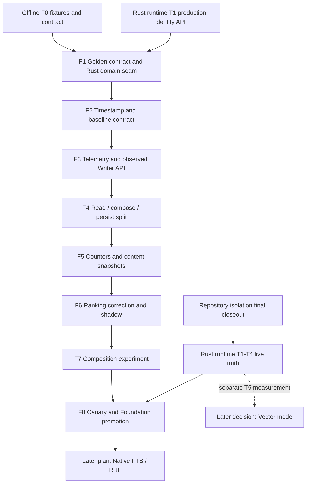
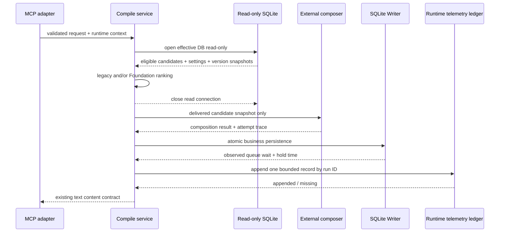

# ContextStill Utility-RAG Foundation Implementation Plan

## Status

Status: reviewed and implementation-ready for Terra; live activation is gated by repository-isolation closeout and Rust runtime T1-T4.

Created: 2026-08-16

Implementation-detail review: 2026-08-17

Plan ID: `contextstill-utility-rag-foundation-v1`

Target scope: Utility-RAG Phase 0 and Phase 0.5 only

Concept authority: [ContextStill Utility-RAG Concept](contextstill-utility-rag-concept.md)

This plan treats the concept as an approved input. It does not add another concept-review phase. It turns the Phase 0 / 0.5 foundation into bounded delivery units with explicit code ownership, persistence contracts, tests, performance gates, rollout, and rollback.

本書はコンセプトを確定入力として扱い、追加のコンセプトレビュー工程を設けない。Phase 0／0.5を、実装担当者が追加のアーキテクチャ判断をせずに着手できるdelivery unitへ分解し、live activationだけを既存の安全gateで制御する。

---

## 0. Terra Execution Contract

この章は、Terraへ本書をそのまま渡した場合の実行契約である。本文と矛盾する場合は、Safety Invariants、Fixed Design Decisions、本章の順で優先する。

### 0.1 Terraが実装時に判断してよいこと

- private helperの配置、局所的な変数名、テスト内のfixture builder名。
- Rust formatterが要求する改行やimport順。
- 同一delivery unit内での、公開されない小さな関数分割。

### 0.2 Terraが判断してはいけないこと

- public MCP request/response、repository eligibility、schema revision、provider call数、top-8/top-3 budgetを変えること。
- 本書の型名、公開範囲、telemetry field、rollout mode、CLI subcommand、artifact pathを別案へ置き換えること。
- prerequisite未達を「おそらく安全」と解釈してlive DBへ書くこと、residentを再起動すること、DBをcopy/move/merge/backfillすること。
- Foundation外のFTS、Vector、Graph、TypeScript ranking parityを同時実装すること。

### 0.3 実行手順

1. 作業開始時に `git status --short` を保存し、既存の変更を自分の変更として上書きしない。
2. F0でscaffold、Foundation code、liveの3つのentry predicateを機械判定する。未達の境界を越えず、live gate未達時はF8へ進まない。
3. F1からF8まで順番を変えない。各unitで「入力、変更、テスト、成果物、exit、stop」をすべて満たしてから次へ進む。
4. 各unitのfocused testを先に通し、その後に広いtestを実行する。skipは成功扱いせず、理由をevidenceへ記録する。
5. 実装中に本書で定義されていないschema、network call、public argument、live mutationが必要になったら停止し、推測で追加しない。
6. commit、push、resident restart、live canaryは、依頼に明示された場合だけ行う。コード実装の依頼だけではF8のlive操作を認可されたと解釈しない。

### 0.4 今すぐ実装を依頼された場合の境界

- TerraはまずF0のmanifest、fixture、evidence draftを実装する。
- Rust runtime T1のproduction identity/build APIがsource treeに存在しない場合、F1を完了扱いにせず停止する。pure type/fixture testを先行作成してもよいが、productionで仮のdatabase identity/build IDへfallbackしたり、未配線コードを「完了」と報告してはいけない。
- T1 APIが存在しfocused testが通る場合、repository-isolationのlive観測完了前でもF1-F7のoffline実装を順番どおり進めてよい。
- F8は別のlive-activation作業である。F8の開始には、本書のlive-entry gateと利用者による明示的な実行依頼の両方が必要である。
- delivery unit外の既存failureを発見した場合、今回の変更に起因するかを切り分け、無関係ならevidenceへ記録して停止判断を求める。無関係な修正を混ぜない。

---

## 1. Executive Decision

Implement the Foundation before FTS, Vector, Utility Graph, Density Selector, or Context Capsule.

The Foundation release has two outcomes.

1. Make the active Rust `context_compile` pipeline measurable and concurrency-safe.
2. Correct the current ranking lockout without introducing a new retrieval lane.

The implementation order is fixed as follows.

1. Finish the effective-database and runtime-truth prerequisites owned by the Rust runtime closeout plan.
2. Preserve current behavior with a golden contract and extract the active compile semantics from the MCP transport boundary.
3. Normalize timestamp reads and formalize canonical new writes.
4. Add phase, provider-attempt, runtime, candidate-count, and writer-occupancy telemetry without a schema revision.
5. Split `context_compile` into read-only preparation, external composition, and short Writer persistence.
6. Restore native selection counters and content-version snapshots.
7. Introduce query-first ranking with dynamic utility as a bounded tie-breaker.
8. Compare composition routes offline, then run shadow, canary, and a 24-hour observation.

The release does not add FTS, embeddings, graph edges, online reranking, or a new network call. It preserves the public MCP input and output contract.

---

## 2. Authority And Dependency Order

The following documents own different constraints. This plan does not weaken or duplicate them.

| Concern | Authority | Effect on this plan |
|---|---|---|
| Repository identity, fail-closed eligibility, producer observation | [Repository Isolation Closeout Plan](context-compile-repository-isolation-improvement-plan.md) | Scope/classification predicates and hard-zero safety gates remain unchanged |
| Live database identity, Doctor, backup, queue truth, controlled restart | [Rust Runtime Closeout Plan](rust-runtime-closeout-implementation-plan.md) | T1-T4 are live-entry prerequisites; T5 Vector is outside this plan |
| Compile semantic ownership and module sequencing | [Repository Isolation First Product Hardening Plan](repository-isolation-first-product-hardening-plan.md) | Rust remains the target semantic owner; TypeScript is not given new ranking semantics |
| Utility-RAG architecture and performance budgets | [Utility-RAG Concept](contextstill-utility-rag-concept.md) | Foundation gate and later-lane boundaries are inherited |

When constraints conflict, apply this precedence.

1. Repository isolation safety invariants.
2. Effective database identity and Writer ownership.
3. Foundation non-inferiority gates.
4. Maintainability and delivery-unit preferences.

### 2.1 Code-entry gate

F0と独立fixture testを開始できる条件は次のとおり。F1-F7へ進む追加条件はT1 production APIの存在とfocused test passである。

- テストは一時DBまたは明示的なread-only snapshotのみを使う。
- resident restart、live DB write、DB copy/move/merge、historical backfillを行わない。
- runtime identityはRust runtime T1が提供するproduction resolverを唯一のsource of truthとし、Foundation側に別resolverを作らない。
- F1完了にはT1 production APIとそのfocused test passが必要である。T1未merge時はF0と独立fixture testだけが許可される。

### 2.2 Live-entry gate

Offline implementation and tests may be developed in an isolated branch before live closeout. Do not rebuild or restart the resident daemon for this plan until all of the following are true.

- The repository-isolation 24-hour audit has passed.
- The repository-isolation final observation has passed: at least 7 days, at least 200 identity-bearing `PERSISTED` events, enabled producer coverage 100%, and new unresolved 0.
- Rust runtime T1-T3 tests pass.
- Rust runtime T4 has established one effective database identity across status, paths, Doctor, backup, queue, and vector diagnostics.
- A recoverable backup of that exact effective database has been verified.

The earliest calendar date is not itself a pass. Every data condition must also be satisfied.

### 2.3 Dependency graph



---

## 3. Confirmed Starting State

This section is a planning snapshot, not a permanent source of truth. F0 must recapture it with the versioned manifest before implementation.

Read-only snapshot at 2026-08-16 22:51 JST:

| Observation | Value | Consequence |
|---|---:|---|
| Resident runtime | Rust `context-stilld` 0.1.0 | Active MCP implementation work starts in Rust |
| Resident/status database | repository `data/context-still-core.sqlite` | This is the live Writer database reported by status |
| `paths`/Doctor/vector database | Application Support database | Effective database identity is not yet unified |
| Doctor | top-level `ok`, nested bootstrap `needs_init` | Readiness cannot yet be used as a release gate |
| Vector health | `ok`, vector tables absent on the inspected DB | Vector is not a Foundation dependency |
| Queue | 1,101 runnable, `maintenance_only`, executor stopped | Queue truth must be closed independently before rollout |
| Classified Knowledge | global 29, repo 69 | Evaluation must not treat all active Knowledge as eligible |
| Unresolved Knowledge | 7,129 | Unresolved remains fail-closed; bulk classification is forbidden |
| Classified EpisodeCard | repo 5,761 | Episode evaluation must use exact request eligibility |
| Producer PERSISTED | 162 | Minimum count alone is not yet met |
| Enabled producer coverage | 1/3 | `episode-distiller.rust` and `register-candidates.rust` are unobserved |
| New unresolved during observation | 0 | Current safety signal is positive |
| Identity-present compile runs | 116 / 1,856, 6.25% | Historical end-to-end baseline is under-sampled |
| Identity-present duration | p50 9,904.5 ms, p95 15,408.75 ms | Provisional only; replace with corrected manifest cohort |

### 3.1 Current active pipeline

The active `context_compile` implementation currently enters `with_writer` before validation and keeps the Writer job while it performs:

- identity and request preparation;
- Knowledge and EpisodeCard reads;
- settings and provider-secret reads;
- planner and Composer network calls;
- pack and usage assembly;
- the final SQLite transaction.

This means external provider latency can occupy the single Writer even though most of the operation is read-only or network-bound.

### 3.2 Current ranking defect

Knowledge ranking currently computes one value equivalent to:

```text
score = query_text_score + rounded_dynamic_score
```

It then uses `score > 0` as candidate eligibility. A high dynamic score can therefore make a query-unmatched item eligible and can lock out query-sensitive candidates.

Episode ranking has a related issue: importance is added before the `score > 0` filter. Foundation corrects both without introducing a learned ranker.

### 3.3 Current timestamp defect

Rust-owned writes use `unix-ms:<integer>`, while other paths and SQLite defaults use ISO or SQLite datetime text. Any report that relies only on `datetime(column)` can silently omit or misorder Rust rows.

Foundation standardizes new active Rust compile writes on `unix-ms:<integer>` and standardizes comparisons on a shared epoch-millisecond projection. It does not rewrite the live history in place.

---

## 4. Goal And Definition Of Done

### 4.1 Goal

Provide a reproducible, scope-safe baseline and a low-contention active Rust compile pipeline so that later retrieval improvements can be evaluated without confounding database identity, Writer occupancy, timing, route-attempt, or ranking-scale defects.

### 4.2 Foundation done

Foundation is complete only when all are true.

- Active Rust compile runs use one effective database identity supplied by the runtime-identity resolver.
- Repository isolation predicates and request identity snapshots are unchanged and pass hard-zero tests.
- Retrieval and settings reads use a SQLite read-only connection.
- No external provider call occurs while the SQLite Writer owns `mcp.context_compile.persist`.
- The final business persistence is one bounded Writer job and one transaction.
- Phase timing, logical LLM calls, provider attempts, failovers, runtime/build identity, pipeline mode, candidate counts, and composition route are queryable from the run snapshot.
- Exact Writer queue/work/total timing and pre-ledger service timing are queryable from the append-only runtime telemetry ledger by run ID; caller-observed end-to-end timing is captured by the paired MCP harness, and missing or malformed ledger records are measurable.
- Baseline reports normalize mixed historical timestamp formats.
- New active Rust compile timestamps have one canonical representation.
- Selected Knowledge and EpisodeCard snapshots contain content hash and source update timestamp when available.
- `compile_select_count` and EpisodeCard `compile_use_count` are updated atomically with pack persistence.
- Query evidence alone determines candidate eligibility.
- Dynamic utility and importance are bounded tie-breakers and cannot introduce a query-unmatched candidate.
- Current safe top-8/top-3 behavior remains available as rollback mode.
- Composition experiments do not add calls to the normal online path.
- Performance, availability, quality, telemetry, and safety promotion gates pass.

### 4.3 Foundation evidence

Implementation creates a separate evidence document:

```text
spec/docs/contextstill-utility-rag-foundation-evidence.md
```

It records the manifest hash, source commit, binary build identity, effective database fingerprint, test counts, skipped tests, benchmark artifacts, canary results, stop decisions, and final promotion decision.

---

## 5. Scope

### 5.1 In scope

- Active Rust-native MCP `context_compile`.
- A Rust-owned compile domain boundary behind the MCP adapter.
- Effective database identity consumption.
- Read-only SQLite compile reads.
- Writer queue wait and hold-time observation.
- Runtime, phase, provider-attempt, failover, and candidate-count telemetry.
- Canonical compile timestamp writes and mixed-format report normalization.
- Content hash/version snapshots.
- Native selection counter updates.
- Query-first deterministic ranking correction.
- Legacy, split, shadow, and Foundation rollout modes.
- Fixed-corpus baseline, ranking, concurrency, and composition experiments.
- Rust tests, SQLite contract tests, MCP smoke, and documentation.

### 5.2 Compatibility work in scope

- TypeScript readers must continue to parse Rust run snapshots with additive diagnostics.
- Shared repository-isolation fixtures remain the safety contract.
- Maintained APIs that display run details must ignore or expose additive diagnostics without rejecting them.
- A capability report records which compile surfaces remain Rust-owned or TypeScript-owned.

### 5.3 Out of scope

- FTS5 retrieval or RRF.
- Vector query generation, embedding cache, vec0, or brute-force cosine.
- Utility Graph schema, edges, traversal, or behavioral learning.
- Density Selector, Context Capsule, or delivery-text compression.
- A new online LLM, embedding, reranker, or provider call.
- Bulk classification of unresolved Knowledge, Source, or EpisodeCard.
- Database copy, move, merge, or automatic path consolidation.
- Queue backlog reset, delete, or provider-policy changes.
- PostgreSQL parity or removal.
- Full TypeScript CLI/UI/API migration to the Rust compile owner.
- Removal of the legacy TypeScript compiler.
- UI controls for Foundation rollout flags.
- Historical timestamp rewrite on the live DB.

---

## 6. Safety And Performance Invariants

These invariants apply in every rollout mode.

1. Identity is resolved once per request and the same snapshot is used by reads, pack, usage, and traces.
2. Eligibility is applied before arbitrary limit and ranking.
3. Missing identity remains global-only.
4. Unresolved, malformed, conflict, and wrong-project items never enter normal candidates.
5. No rollback may restore an unscoped fallback.
6. Shadow-only candidate text is never sent to a provider, returned to the caller, inserted into the pack, or counted as used.
7. In split modes, the query/read phase never receives a writable SQLite connection; `legacy` is the documented rollback exception.
8. Provider secrets, prompts, response bodies, Knowledge bodies, and absolute database paths are not written to Foundation telemetry.
9. In split modes, the external compose phase never retains a SQLite connection or Writer handle; `legacy` preserves the prior boundary only for rollback.
10. Persistence does not update current Knowledge content from an older read snapshot.
11. Business persistence is atomic: run, task trace, pack items, candidate traces, usage, feedback, and counters commit together or not at all.
12. Runtime-ledger append failure cannot roll back a successfully persisted context pack and cannot be counted as a complete performance sample.
13. Normal online logical LLM calls and provider attempts do not increase relative to the selected baseline route.
14. Later retrieval lanes cannot be smuggled into Foundation behind a feature flag.

---

## 7. Fixed Design Decisions

### 7.1 Semantic owner

Rust is the Foundation semantic owner. `native_compile.rs` becomes a thin MCP request/response adapter. New compile semantics live in a Rust domain, not in TypeScript. This closes the Foundation portion of the hardening plan's A0 ownership decision; the later TypeScript caller migration remains A1 and is not pulled into this release.

TypeScript compile surfaces are recorded in the capability matrix but are not given a parallel Foundation ranking implementation. Their migration is a later ownership-convergence delivery.

### 7.2 Timestamp contract

Canonical new Rust persistence format:

```text
unix-ms:<non-negative base-10 epoch milliseconds>
```

Comparison and ordering use a shared normalized epoch-millisecond projection.

```sql
case
  when value like 'unix-ms:%'
   and length(substr(value, 9)) between 1 and 16
   and substr(value, 9) not glob '*[^0-9]*'
   and cast(substr(value, 9) as integer) between 0 and 8640000000000000
    then cast(substr(value, 9) as integer)
  when typeof(value) = 'text'
   and length(value) >= 19
   and substr(value, 1, 4) not glob '*[^0-9]*'
   and substr(value, 5, 1) = '-'
   and substr(value, 6, 2) not glob '*[^0-9]*'
   and substr(value, 8, 1) = '-'
   and substr(value, 9, 2) not glob '*[^0-9]*'
   and substr(value, 11, 1) in (' ', 'T')
   and substr(value, 12, 2) not glob '*[^0-9]*'
   and substr(value, 14, 1) = ':'
   and substr(value, 15, 2) not glob '*[^0-9]*'
   and substr(value, 17, 1) = ':'
   and substr(value, 18, 2) not glob '*[^0-9]*'
   and julianday(value) is not null
   and cast(round((julianday(value) - 2440587.5) * 86400000.0) as integer)
       between 0 and 8640000000000000
    then cast(round((julianday(value) - 2440587.5) * 86400000.0) as integer)
  else null
end
```

Rules:

- Prefix matching alone is forbidden: `unix-ms:1junk`, an empty suffix, a signed suffix, overflow, and values outside the ECMAScript `Date` range are invalid.
- Invalid timestamps are counted and excluded from time-window metrics; they are never treated as current time.
- Equal normalized timestamps are ordered by stable row ID.
- APIs requiring RFC3339 convert at the presentation boundary.
- No live historical row is rewritten in Foundation.
- Rust and TypeScript keep separate implementations but consume one normative fixture: `test/fixtures/timestamp-normalization-v1.json`. The fixture contains raw input, expected epoch milliseconds or `null`, and stable-order cases.
- `src/modules/context-compiler/context-compiler.repository.utils.ts::normalizeDate`, `repository-isolation-report.repository.ts::dateFromUnknown`, and `sqliteTimestampMillis` must conform to the fixture. No new permissive parser is allowed.

### 7.3 Schema strategy

Foundation v1 adds no SQLite table, column, index, `user_version`, or `schema_migrations` revision.

Reasons:

- A new additive revision would prevent direct rollback to a binary whose `CURRENT_SCHEMA_REVISION` is lower.
- Existing `pack_snapshot`, `context_compile_candidate_traces.evidence`, and run/task fields can carry the bounded Foundation contract.
- The candidate scale is small enough that JSON extraction is acceptable for Foundation reports.

If later measurements prove JSON aggregation inadequate, a normalized telemetry table requires a separate migration plan with explicit N-1 binary compatibility. It is not added opportunistically.

### 7.4 Ranking policy

Foundation uses deterministic lexicographic ranking.

Knowledge:

```text
eligible when query_score > 0
order by:
  query_score desc,
  bounded_dynamic_utility desc,
  importance desc,
  updated_at_epoch_ms desc,
  id asc
```

EpisodeCard:

```text
eligible when query_score > 0
order by:
  query_score desc,
  importance desc,
  updated_at_epoch_ms desc,
  id asc
```

`dynamic_score` is normalized before comparison: non-finite values become 0 and finite values are clamped to `[0, 100]`. It never changes candidate eligibility and never outranks a higher query score. The trace keeps both the raw value and the normalized tie-break value. No weight tuning is required for Foundation.

Because JSON cannot represent non-finite numbers, `rawDynamicUtility` is `null` and `rawDynamicUtilityNonFinite=true` for NaN/infinity; otherwise the raw finite value is stored and the flag is false. `boundedDynamicUtility` is always a finite number in `[0, 100]`.

`query_score` keeps the current `native_common.rs::score_text` algorithm byte-for-byte in Foundation. Knowledge input is exactly `title + "\n" + body`; EpisodeCard input is exactly `title + "\n" + situation + "\n" + lesson`; the query remains the existing `search_text(goal, technologies, changeTypes, domains)`. F6 separates features and ordering but does not add stemming, token weighting, exact-match boosts, FTS behavior, or a changed normalization rule. Move `score_text` into the compile domain and retain a compatibility wrapper only if another native tool still calls it.

Implement ordering as explicit tuple comparison, not by combining features into one number. Normalized valid timestamps sort newest first; invalid/`None` timestamps sort after every valid timestamp; ID ascending is the final total-order key. Use the finite clamped `boundedDynamicUtility` for float comparison so no partial-order/NaN fallback is needed.

### 7.5 Rollout mode

Add one startup setting, parsed strictly and captured in the runtime context:

```text
CONTEXT_STILL_COMPILE_FOUNDATION_MODE=
  legacy
  split_legacy_rank
  split_shadow_rank
  foundation
```

Semantics:

| Mode | Writer boundary | Delivered ranking | Shadow trace |
|---|---|---|---|
| `legacy` | Existing whole-operation Writer ownership | Current ranking | none |
| `split_legacy_rank` | Read / compose / short persist | Current ranking | none |
| `split_shadow_rank` | Read / compose / short persist | Current ranking | Foundation IDs/scores only |
| `foundation` | Read / compose / short persist | Foundation ranking | legacy IDs/scores only |

Invalid values fail resident startup. They do not silently default. The initial code default is `legacy`; the controlled resident configuration selects later modes.

An absent variable means `legacy`. A present value is ASCII-trimmed and must then equal one lowercase token in the table; empty, mixed-case, or unknown values are invalid. Parse once while constructing `CompileRuntimeContext`. Tests cover absent, every valid token, empty, surrounding whitespace, mixed-case, and unknown values.

### 7.6 Composition routes

Foundation implements an opt-in experiment harness for:

- `current_two_call`: current planner plus Composer route;
- `single_compose`: one provider call with the same candidate snapshot;
- `deterministic`: no provider call.

The normal online default remains `current_two_call` until a route passes its own paired quality and non-inferiority gate. Foundation completion requires a recorded decision, not a forced route switch.

The harness is exposed only through the operator CLI in section 10.3. It prepares each manifest query once, then supplies owned clones of that exact snapshot to every enabled route. It cannot be enabled through MCP arguments or the rollout-mode environment variable.

---

## 8. Target Architecture

### 8.1 Runtime flow



### 8.2 Rust module boundary

Target structure:

```text
crates/context-stilld/src/domains/context_compile/
  mod.rs
  types.rs
  service.rs
  request.rs
  legacy.rs
  read_repository.rs
  ranking.rs
  composer.rs
  persistence.rs
  telemetry.rs
  telemetry_ledger.rs
  report.rs
  routing.rs
  tests.rs

crates/context-stilld/src/domains/mcp_lifecycle/native_compile.rs
  thin parameter validation / adapter only
```

Dependency direction:

```text
mcp_lifecycle -> context_compile -> sqlite_writer / runtime identity
                               -> provider transport
```

`context_compile` must not depend on MCP JSON envelopes. Provider transport/parser must not depend on persistence. Ranking must be a pure function over owned candidate snapshots.

### 8.3 Core types

The following names and ownership boundaries are fixed. A delivery unit may add private SQL row structs or helper enums, but it must not collapse these boundaries or rename them without updating this plan first.

```rust
pub(crate) struct CompileRuntimeContext {
    pub(crate) project_root: PathBuf,
    pub(crate) database: EffectiveDatabaseIdentity,
    pub(crate) runtime_version: String,
    pub(crate) runtime_build_id: String,
    pub(crate) mode: CompileFoundationMode,
    pub(crate) telemetry_ledger: Arc<FoundationTelemetryLedger>,
}

pub(crate) struct CompileRequest {
    pub(crate) goal: String,
    pub(crate) session_id: Option<String>,
    pub(crate) facets: RepositoryRequestFacets,
}

pub(crate) struct PreparedCompile {
    pub(crate) run_id: String,
    pub(crate) request: CompileRequest,
    pub(crate) identity: ResolvedCompileProjectIdentity,
    pub(crate) knowledge: Vec<KnowledgeSnapshot>,
    pub(crate) episodes: Vec<EpisodeSnapshot>,
    pub(crate) legacy_selection: Selection,
    pub(crate) foundation_selection: Selection,
    pub(crate) composer_settings: ComposerSettings,
    pub(crate) telemetry: CompileTelemetryDraft,
}

pub(crate) struct CompositionResult {
    pub(crate) markdown: String,
    pub(crate) used_knowledge: Vec<UsedKnowledge>,
    pub(crate) used_episodes: Vec<UsedEpisode>,
    pub(crate) route: CompositionRoute,
    pub(crate) attempts: Vec<ProviderAttempt>,
    pub(crate) degraded_reasons: Vec<String>,
}

pub(crate) struct PersistCompile {
    pub(crate) prepared: PreparedCompile,
    pub(crate) delivered_selection: Selection,
    pub(crate) composition: CompositionResult,
}

pub(crate) struct CompileOutput {
    pub(crate) markdown: String,
    pub(crate) run_id: String,
}
```

`EffectiveDatabaseIdentity` is imported from the completed Rust runtime T1 implementation; Foundation must not define a competing resolver or reconstruct the identity from ambient environment variables. Do not derive `Debug`, `Serialize`, or `Clone` for structures containing provider secrets, full prompt payloads, or response bodies. `CompileOutput.run_id` remains internal; the MCP adapter returns the existing text contract only.

### 8.4 Read-only connection

Open one connection per compile request using read-only flags. Configure:

- `SQLITE_OPEN_READ_ONLY`;
- `PRAGMA query_only = ON`;
- `busy_timeout(Duration::from_millis(100))`;
- `PRAGMA foreign_keys = ON`.

Opening the file, setting either PRAGMA, or setting the timeout is fallible and returns `CompileError`; never retry by opening a default writable connection. A focused test asserts `pragma query_only = 1`, `pragma foreign_keys = 1`, and `pragma busy_timeout = 100`, then proves all DML and DDL attempts fail.

Do not execute `journal_mode`, migration, checkpoint, temp schema, or any write-capable PRAGMA on the read path. Use the effective path already resolved by Rust runtime T1.

The read connection is dropped before the first provider call. A concurrency test must prove that no `Connection` or Writer closure survives into composition.

### 8.5 Snapshot consistency

Each candidate snapshot includes:

- entity ID and kind;
- title and retrieval/delivery content used for this run;
- source refs;
- scope snapshot and identity basis;
- item `updated_at` raw value and normalized epoch milliseconds when valid;
- SHA-256 content hash over the selected fields;
- query score and bounded tie-break features;
- delivered, shadow, suppressed, and use state.

If the current entity changes between read and persist, store the selection snapshot. Do not overwrite the current entity. Counter update mismatch is recorded in diagnostics.

Content-version evidence uses `sha256-canonical-json-v1`. Serialize a JSON object with lexicographically sorted keys and UTF-8 without whitespace. Normalize the existing Knowledge `sourceRefs` string array by de-duplicating exact strings and sorting them lexicographically. Knowledge hashes exactly `entityKind`, `id`, `type`, `polarity`, `title`, `body`, and normalized `sourceRefs`. EpisodeCard hashes exactly `entityKind`, `id`, `title`, `situation`, and `lesson`. Do not include scores, counters, scope, or timestamps in the hash.

For every selected candidate, `context_compile_candidate_traces.evidence.foundation.contentVersion` contains:

```json
{
  "algorithm": "sha256-canonical-json-v1",
  "sha256": "lowercase-64-hex",
  "sourceUpdatedAtRaw": "unix-ms:... or original text",
  "sourceUpdatedAtEpochMs": 1786896000000
}
```

`sourceUpdatedAtEpochMs` is `null` when normalization fails; the raw value is bounded to 128 characters and the invalid count is incremented. Full content is stored only in the existing pack snapshot/items required for replay, never duplicated into Foundation diagnostics or the runtime ledger.

### 8.6 Fixed function boundary

The implementation exposes exactly these domain entry points inside the crate:

```rust
// service.rs
pub(crate) fn compile(
    request: CompileRequest,
    context: &CompileRuntimeContext,
) -> Result<CompileOutput, CompileError>;

// legacy.rs
pub(crate) fn compile_legacy_on_writer(
    request: CompileRequest,
    context: &CompileRuntimeContext,
) -> Result<WriterExecution<CompileOutput>, CompileError>;

// read_repository.rs
pub(crate) fn prepare_compile(
    request: CompileRequest,
    context: &CompileRuntimeContext,
) -> Result<PreparedCompile, CompileError>;

// composer.rs
pub(crate) fn compose(
    prepared: &PreparedCompile,
    route: CompositionRoute,
) -> Result<CompositionResult, CompileError>;

// persistence.rs
pub(crate) fn persist(
    command: PersistCompile,
    context: &CompileRuntimeContext,
) -> Result<WriterExecution<CompileOutput>, CompileError>;

// telemetry_ledger.rs
pub(crate) fn append_writer_record(
    ledger: &FoundationTelemetryLedger,
    record: &WriterTelemetryRecord,
) -> Result<(), TelemetryLedgerError>;
```

`native_compile.rs::context_compile` performs only MCP JSON validation, construction of `CompileRequest`, the `service::compile` call, and conversion of `CompileError`/`CompileOutput` to the existing MCP envelope. SQL, ranking, provider prompt construction, and pack assembly are forbidden in the adapter after F4.

`service::compile` dispatches by the startup-captured mode. `legacy` calls `legacy::compile_legacy_on_writer` and preserves whole-operation Writer ownership for rollback parity. The three split modes call `prepare_compile`, drop the read connection, call `compose`, then call `persist`. No request re-reads the mode from the environment.

### 8.7 Exact integration touch points

| Existing file | Required change | Forbidden change |
|---|---|---|
| `domains/mcp_lifecycle/native_tools.rs` | Keep `project_root` and `sqlite_core_path`; add `compile_runtime: Arc<CompileRuntimeContext>` to `NativeToolContext` | Resolve a second DB identity |
| `domains/mcp_lifecycle/dispatch.rs` | Keep the three existing fields; add `compile_runtime: Arc<CompileRuntimeContext>` to `DispatchConfig` | Parse mode per request |
| `domains/mcp_lifecycle/endpoint_server.rs` | Change `dispatch_config` to return `Result<DispatchConfig, CliError>`; build the context once from T1 runtime identity, `VERSION`, build ID, mode, and `resolve_paths(env).logs_dir`; propagate failure from `start_in_process`; clone the `Arc` in `native_context` | Read mode or build ID from MCP arguments |
| `domains/mcp_lifecycle/native_common.rs` | Move shared timestamp helpers to the domain/shared utility; retain compatibility wrappers only while other native tools need them | Open a writable read connection |
| `domains/mcp_lifecycle/native_compile.rs` | Shrink to the adapter described above; preserve current error/output behavior through golden fixtures | Keep a Writer closure around network calls |
| `domains/sqlite_writer/service.rs` | Add observed execution at the existing enqueue/dequeue/finish/receive points | Create a second Writer or change serialization semantics |
| `domains/sqlite_writer/mod.rs` | Re-export the observed types and `execute_for_path_observed` | Remove existing exports |
| `domains/cli/routing.rs` | Add `ContextCompileAction` and `CliCommand::ContextCompile`; parse the exact commands in section 10.3 | Put report logic in the parser |
| `domains/cli/service.rs` | Add exact help lines and examples | Advertise live mutation |
| `lib.rs` | Dispatch `CliCommand::ContextCompile` to `domains::context_compile::routing::handle_command` | Duplicate report behavior |

The CLI parser accepts only these option sets:

```text
capabilities: [--out <new-report.json>] [--json]
baseline:     --manifest <path> --out <new-report.json> [--probe <probe-report.json>] [--json]
compare:      --manifest <path> --baseline <baseline-report.json> --candidate <candidate-report.json> --out <new-report.json> [--json]
experiment:   --manifest <path> --out <new-report.json> --allow-provider-calls [--json]
probe:        --manifest <path> --entry-report <capabilities-report.json> --out <new-report.json> --calls <positive-integer> --allow-live-writes [--json]
```

The routing types are fixed:

```rust
pub enum ContextCompileAction {
    Capabilities { out: Option<PathBuf> },
    Baseline { manifest: PathBuf, out: PathBuf, probe: Option<PathBuf> },
    Compare {
        manifest: PathBuf,
        baseline: PathBuf,
        candidate: PathBuf,
        out: PathBuf,
    },
    Experiment { manifest: PathBuf, out: PathBuf, allow_provider_calls: bool },
    Probe {
        manifest: PathBuf,
        entry_report: PathBuf,
        out: PathBuf,
        calls: usize,
        allow_live_writes: bool,
    },
}

pub enum CliCommand {
    // existing variants unchanged
    ContextCompile { action: ContextCompileAction, json: bool },
}
```

Missing required value, repeated option, unknown option, or positional remainder returns `CliError::invalid_arguments`. Option order is arbitrary. JSON mode writes one JSON object to stdout; diagnostics go to stderr and must not corrupt stdout.

At resident startup, an invalid rollout mode, missing T1 runtime identity/build ID, or inability to create/open the process ledger directory/file returns `CliError` and prevents MCP endpoint publication. After startup, an individual append/flush failure follows section 9.3 and does not retroactively fail a successfully persisted compile.

### 8.8 Atomic persistence order

`persistence::persist` submits one `mcp.context_compile.persist` Writer job and starts one SQLite transaction. Within it, execute in this order:

1. insert `context_compile_runs` with `snapshotComplete=false` and the semantic telemetry known before mutation;
2. insert task trace;
3. insert pack items;
4. insert the bounded candidate-trace union;
5. insert Knowledge usage events, Episode usage rows, feedback, and existing auxiliary run rows;
6. update de-duplicated Knowledge/Episode counters and collect affected-row counts;
7. update only that run's `pack_snapshot.diagnostics.foundation` with counter diagnostics and `snapshotComplete=true`;
8. commit.

Any required statement error rolls back the transaction. In split modes, the current schema revision and these tables are required: `context_compile_runs`, `context_compile_task_traces`, `context_pack_items`, `context_compile_candidate_traces`, `knowledge_items`, `episode_cards`, `knowledge_usage_events`, and `episode_retrieval_feedback`. `settings`/provider configuration may be absent and follows the existing deterministic/degraded composition behavior. `legacy` preserves the current missing-table degradation contract captured by F1 golden cases. There is no post-commit SQLite update for Foundation telemetry. The runtime-ledger append is the sole post-Writer persistence action.

---

## 9. Telemetry Contract

### 9.1 Two-store model

Writer timing cannot be finalized by updating the same run through a second Writer job: that second job's own queue/work duration is unknown until it has completed. Foundation therefore uses two stores with one join key.

| Store | Written when | Contents | Authority |
|---|---|---|---|
| `context_compile_runs.pack_snapshot.diagnostics.foundation` | Inside the atomic business transaction | semantic/pre-persist telemetry known before Writer completion | Run semantics, ranking, route, attempts, counts |
| `<logs_dir>/context-compile-foundation/<ledger-id>.<sequence>.jsonl` | Once, after observed Writer completion | exact Writer and pre-ledger service timing/result | Writer occupancy and phase consistency |
| `context_compile_candidate_traces.evidence.foundation` | Inside the atomic business transaction | per-candidate numeric ranking evidence | Candidate audit |

The shared key is the existing `runId`. The SQLite snapshot declares `writerTelemetryExpected=true`; it never claims that the later ledger append already succeeded. A performance sample is complete only when the report finds exactly one valid matching ledger record.

### 9.2 Persisted run-snapshot contract

```json
{
  "contractVersion": 1,
  "snapshotComplete": true,
  "writerTelemetryExpected": true,
  "pipelineVersion": "foundation-v1",
  "pipelineMode": "split_shadow_rank",
  "runtime": {
    "engine": "rust-native",
    "version": "0.1.0",
    "buildId": "opaque-build-id",
    "databaseIdentitySource": "live_resident_state",
    "databaseIdentityFingerprint": "sha256"
  },
  "timingsUs": {
    "prepare": 0,
    "retrieval": 0,
    "compose": 0
  },
  "llm": {
    "logicalCalls": 0,
    "providerAttempts": 0,
    "failovers": 0,
    "attempts": []
  },
  "candidates": {
    "eligibleKnowledge": 0,
    "queryMatchedKnowledge": 0,
    "deliveredKnowledge": 0,
    "eligibleEpisodes": 0,
    "queryMatchedEpisodes": 0,
    "deliveredEpisodes": 0
  },
  "persistence": {
    "knowledgeCounterExpected": 0,
    "knowledgeCounterUpdated": 0,
    "missingKnowledgeIds": [],
    "episodeCounterExpected": 0,
    "episodeCounterUpdated": 0,
    "missingEpisodeIds": []
  },
  "compositionRoute": "current_two_call",
  "rankingPolicy": "legacy"
}
```

All fields shown are required. Integers use non-negative microseconds/counts. The example defines field names and semantics; JSON serialization order is not significant.

Candidate count semantics are fixed: `eligible*` is the active, classified, scope-safe, facet-matching set before query-score filtering; `queryMatched*` is the subset with `queryScore > 0`; `delivered*` is the unique ordered set supplied to the selected composition route. Shadow-only candidates are never included in `delivered*`.

Candidate trace volume is bounded. In modes without shadow comparison, persist only the delivered selection. In `split_shadow_rank` and `foundation`, persist the ordered union of legacy and Foundation top-budget selections: at most 16 Knowledge rows and 6 EpisodeCard rows per run before de-duplication. `selected=1` means delivered in the active mode. A union member not delivered has `suppressed=1` and `suppression_reason='shadow_only'`. `evidence.foundation` records entity kind, legacy/foundation rank, query score, raw and normalized tie-break features, content version, and `delivered`/`shadow` booleans. Do not persist every eligible row; aggregate counts preserve corpus-size visibility.

### 9.3 Runtime Writer-ledger contract

Each resident process owns one append-only segment series named `<ledger-id>.<six-digit-sequence>.jsonl`. Compute `ledger-id` as the first 16 lowercase hex characters of SHA-256 over `runtimeBuildId + "\n" + pid + "\n" + processStartedAt`. The directory comes from `resolve_paths(env).logs_dir`; neither the absolute log path nor the absolute DB path appears in a record.

```json
{
  "contractVersion": 1,
  "runId": "ctxrun_opaque",
  "recordedAt": "unix-ms:1786896000000",
  "pipelineVersion": "foundation-v1",
  "pipelineMode": "split_shadow_rank",
  "runtimeVersion": "0.1.0",
  "runtimeBuildId": "opaque-build-id",
  "databaseIdentityFingerprint": "sha256",
  "writer": {
    "operation": "mcp.context_compile.persist",
    "queueWaitUs": 0,
    "workUs": 0,
    "totalUs": 0,
    "success": true,
    "errorCategory": null
  },
  "preLedgerEndToEndUs": 0
}
```

Implementation rules:

- `writer.operation` is exactly `mcp.context_compile` in `legacy` and `mcp.context_compile.persist` in every split mode.
- `FoundationTelemetryLedger` owns one mutex-protected active segment opened with `create_new(true)`, `append(true)`, and write-only access. No request opens its own ledger file.
- Serialize to an in-memory byte buffer, reject a record over 16 KiB, append the bytes plus one newline using `write_all`, then call `flush`. `sync_all` is not in the request critical path.
- Before an append would make a segment exceed 16 MiB, flush and close it, increment the sequence, and open the next segment with `create_new`. Retain the active segment plus the seven newest closed segments for that ledger ID; after the new segment opens successfully, remove older closed segments under the same ledger mutex. Never delete another ledger ID's files.
- `queueWaitUs`, `workUs`, and `totalUs` are required but may be `null` only when the outer observed API returns `Err` before a job can be observed. Such a record has `success=false` and a bounded `errorCategory`.
- There is exactly one append attempt per compile invocation after the observed API returns, including outer submission failure and persistence-job failure when a run row was not committed.
- Ledger append failure does not change an already successful MCP result. It emits one bounded structured error containing run ID, build ID, and error category, but no content or path.
- A malformed/truncated line, duplicate run ID, mismatched build/pipeline/database fingerprint, or missing record makes that run performance-incomplete. Reports count each exclusion reason.
- Reports scan every valid segment name in the directory. A file that disappears or changes size while being read is counted as `ledger_segment_changed` and makes that report promotion-ineligible; retrying the report is safe because it is read-only. Evidence records the retained segment names, sizes, and hashes at capture time.

### 9.4 Provider-attempt trace

Each attempt records only:

- logical call kind: planner or composer;
- logical call ordinal;
- attempt ordinal;
- provider and model identifiers;
- route position;
- success, timeout, rate-limited, transport-error, or parse-error status;
- duration;
- failover-from reason code;
- bounded error category.

Do not store API keys, authorization headers, raw prompt, raw response, full URL query strings, or Knowledge body.

### 9.5 Observed Writer API

Add a non-breaking observed execution API to `sqlite_writer` with these exact public-within-crate fields:

```rust
pub(crate) struct WriterExecution<T> {
    pub(crate) result: Result<T, String>,
    pub(crate) queue_wait: Duration,
    pub(crate) work_duration: Duration,
    pub(crate) total_duration: Duration,
}

impl SqliteWriterHandle {
    pub(crate) fn execute_observed<T, F>(
        &self,
        operation: impl Into<String>,
        job: F,
    ) -> Result<WriterExecution<T>, String>
    where
        T: Send + 'static,
        F: FnOnce(&mut Connection) -> Result<T, String> + Send + 'static;
}

pub(crate) fn execute_for_path_observed<T, F>(
    path: &Path,
    operation: &'static str,
    job: F,
) -> Result<WriterExecution<T>, String>
where
    T: Send + 'static,
    F: FnOnce(&mut Connection) -> Result<T, String> + Send + 'static;
```

The outer `Err` means the job could not be submitted/observed. `WriterExecution.result` is the closure result. Existing `execute` and `execute_for_path` delegate to the observed primitive and return the old `Result<T, String>` by flattening these two layers; all existing callers remain source-compatible.

Timing points use `Instant`, never wall-clock timestamps:

- enqueue: immediately before channel send;
- start: immediately after worker dequeue and before setting `active_operation`;
- finish: immediately after the closure returns and before clearing `active_operation`;
- receive: immediately after the caller receives the response;
- `queue_wait = start - enqueue`;
- `work_duration = finish - start`;
- `total_duration = receive - enqueue`.

The worker response therefore carries start/finish-derived durations in addition to the job result. Existing queue depth, success/failure counts, last operation, and active-operation behavior must remain unchanged.

### 9.6 Timing consistency and report join

The baseline/compare reader loads valid JSONL records into a `runId` map, rejects duplicates, and joins them to run snapshots only when `pipelineVersion`, `runtimeBuildId`, and `databaseIdentityFingerprint` also match. Failed persistence records without a run row contribute to availability counts but not latency percentiles.

For complete successful samples:

```text
prepare + retrieval + compose + writer.totalUs <= preLedgerEndToEndUs + tolerance
writer.queueWaitUs + writer.workUs <= writer.totalUs + tolerance
```

Tolerance is the greater of 2 ms or 1% of `preLedgerEndToEndUs`. Violations are reported and excluded; repeated violations stop promotion. The ledger cannot include its own append duration without becoming self-referential. Promotion end-to-end p50/p95 therefore comes from the paired MCP client timer measured immediately before request send through complete response receipt; the report keeps this metric separate as `callerObservedEndToEndUs`.

---

## 10. Baseline And Experiment Manifest

### 10.1 Versioned inputs

Implementation adds:

```text
spec/context-compile-foundation/manifest.v1.json
spec/context-compile-foundation/hard-query-set.v1.json
test/fixtures/context-compile-foundation-v1.json
```

The implementation workflow passes `--out .tmp/context-compile-foundation/<manifest-id>/<artifact>.json`; generated reports are not treated as source. The command itself accepts another explicit new file path for isolated tests. The evidence document records report SHA-256 hashes and the stable aggregate.

The source manifest contains thresholds and fixture paths, not a mutable live DB fingerprint or source commit. Every generated report binds the run to `sourceCommit`, source-tree/build identity, `runtimeBuildId`, effective DB fingerprint, manifest hash, and every input-fixture hash. This prevents a version-controlled threshold manifest from becoming stale after the next code change.

### 10.2 Manifest minimum contract

```json
{
  "id": "contextstill-utility-rag-foundation-v1",
  "pipelineVersion": "foundation-v1",
  "inputs": {
    "hardQuerySet": "hard-query-set.v1.json",
    "goldenFixture": "../../test/fixtures/context-compile-foundation-v1.json",
    "timestampFixture": "../../test/fixtures/timestamp-normalization-v1.json"
  },
  "runtimeBinding": {
    "sourceCommitRequired": true,
    "runtimeBuildIdRequired": true,
    "effectiveDatabaseFingerprintRequired": true,
    "cleanSourceTreeRequiredForPromotion": true
  },
  "cohorts": {
    "historicalIdentityPresentMin": 500,
    "retrievalFixtureRuns": 500,
    "rankingHardQueriesMin": 50,
    "compositionQueriesMinPerRoute": 30,
    "liveBaselineProbeMin": 100,
    "shadowIdentityPresentMin": 50,
    "canaryIdentityPresentMin": 100,
    "canaryWindowHours": 24
  },
  "performance": {
    "endToEndP50MultiplierMax": 1.02,
    "endToEndP95MultiplierMax": 1.02,
    "retrievalP95AbsoluteMsMax": 100,
    "retrievalP95AddedMsMax": 5,
    "writerQueueWaitP95MsMax": 20,
    "persistenceP95MsMax": 25
  },
  "availability": {
    "noContentRateAddedMax": 0.01,
    "toolErrorRateAddedMax": 0.0,
    "composerDegradedRateAddedMax": 0.05
  },
  "ranking": {
    "existingUsedKnowledgeRetentionMin": 0.99,
    "queryLockoutViolationMax": 0,
    "mustNotIncludeAddedMax": 0
  },
  "telemetry": {
    "writerLedgerCompleteRateMin": 0.99,
    "timingConsistencyViolationRateMax": 0.01,
    "redactionViolationMax": 0
  },
  "statistics": {
    "confidenceLevel": 0.95,
    "pairedBootstrapIterations": 10000,
    "bootstrapSeed": 1337
  },
  "safety": {
    "wrongProjectMax": 0,
    "unresolvedSelectedMax": 0,
    "shadowOutboundMax": 0,
    "identityMismatchMax": 0
  },
  "stopConditions": [
    "safety_violation",
    "database_identity_mismatch",
    "writer_ownership_violation",
    "provider_call_increase",
    "performance_gate_failure"
  ]
}
```

Resolve input paths relative to the manifest file, not the current working directory. The implementation validates the manifest strictly and rejects unknown fields. Missing fixture references, sample sizes, margins, runtime-binding requirements, or stop conditions make the command fail. Missing source commit, build ID, effective DB fingerprint, or fixture hash in a generated report makes promotion ineligible.

Percentiles use nearest-rank on ascending values: index `max(0, ceil(p * n) - 1)`. Paired bootstrap resamples paired query indices with replacement. Use the manifest seed as `u64` and update it for every draw with `state = state * 6364136223846793005 + 1442695040888963407` using wrapping arithmetic; sample index is `state % n`. Confidence bounds use the same nearest-rank rule over the sorted bootstrap deltas. Empty cohorts yield `null`, never zero, and fail the applicable minimum-sample gate.

### 10.3 Baseline command surface

Add Rust-owned commands with package-script wrappers:

```text
context-stilld context-compile capabilities --out <new-report.json> --json
context-stilld context-compile baseline --manifest <path> --probe <probe-report.json> --out <new-report.json> --json
context-stilld context-compile compare --manifest <path> --baseline <baseline-report.json> --candidate <candidate-report.json> --out <new-report.json> --json
context-stilld context-compile experiment --manifest <path> --out <new-report.json> --allow-provider-calls --json
context-stilld context-compile probe --manifest <path> --entry-report <capabilities-report.json> --out <new-report.json> --calls 100 --allow-live-writes --json

bun run foundation:capabilities -- --out <new-report.json>
bun run foundation:baseline -- --manifest <path> --probe <probe-report.json> --out <new-report.json>
bun run foundation:compare -- --manifest <path> --baseline <baseline-report.json> --candidate <candidate-report.json> --out <new-report.json>
bun run foundation:experiment -- --manifest <path> --out <new-report.json> --allow-provider-calls
bun run foundation:probe -- --manifest <path> --entry-report <capabilities-report.json> --out <new-report.json> --calls 100 --allow-live-writes
```

Add these exact `package.json` entries; callers supply all subcommand options after `--`:

```json
{
  "foundation:capabilities": "cargo run -q -p context-stilld -- context-compile capabilities",
  "foundation:baseline": "cargo run -q -p context-stilld -- context-compile baseline",
  "foundation:compare": "cargo run -q -p context-stilld -- context-compile compare",
  "foundation:experiment": "cargo run -q -p context-stilld -- context-compile experiment",
  "foundation:probe": "cargo run -q -p context-stilld -- context-compile probe"
}
```

Rules:

- `capabilities`, `baseline`, and `compare` are read-only. `experiment` may call providers but never writes the DB. Only `probe` performs normal MCP compile calls and their ordinary business writes.
- They resolve the same effective database identity as status and Doctor.
- They refuse an identity mismatch.
- They never copy the database automatically.
- `--out` is required for baseline/compare/experiment/probe and optional for capabilities; whenever present it must not already exist. Write to a sibling temporary file, `flush`, then atomically rename it. Remove only that temporary file on failure.
- `baseline --probe` validates and incorporates caller-observed timings from the probe; omitting `--probe` is allowed for provisional historical/offline analysis but leaves caller-observed performance gates ineligible.
- `compare` reads only the two explicit report files. It rejects a report whose manifest hash, pipeline version, build/source identity policy, effective database fingerprint, or fixture hashes are incompatible, and it never selects “latest” artifacts from a directory.
- `--json` prints the exact report object to stdout in addition to writing it to `--out`; without it, stdout is a bounded human summary. Diagnostics use stderr.
- `experiment` refuses to run without the exact `--allow-provider-calls` flag, never writes run/business tables, prepares through a read-only connection, and does not write prompts or composed bodies to its report. It records hashes, IDs, counts, timings, route outcomes, and bounded error categories.
- `capabilities --json` includes the three entry decisions, their individual predicates, runtime build/mode, effective DB fingerprint, and backup fingerprint. F0 supplies `--out` to save this exact JSON as the capabilities entry report and records its hash in evidence.
- `probe` refuses to run without the exact `--allow-live-writes` flag and an explicit `--entry-report` whose `liveEntryEligible=true`, build ID, effective DB fingerprint, and runtime mode still match current runtime truth. The report must be at most 10 minutes old by normalized timestamp. It cycles manifest queries in file order, creates a unique session ID per request, calls the resident MCP endpoint, measures send-through-response latency with `Instant`, and writes a content-redacted probe report. A probe never changes rollout mode or restarts the resident.
- Fixture benchmarks use a temp DB or read-only snapshot, never the live DB for writes.
- `baseline` has two explicitly labeled cohorts: `historicalReadOnly` from the effective DB and `fixedFixture` from a temp DB built from the versioned fixture. It never mixes their rows or denominators.
- `experiment` builds candidates from the same fixed-fixture temp DB and reads only provider configuration from the effective DB. This keeps route inputs reproducible without writing live run tables.
- `probe` uses the query goals/facets against the live cohort for performance/availability only. Fixture-only expected entity IDs are not scored against live rows.
- Reports include command version, manifest hash, commit, build ID, database fingerprint, row counts, timestamp-invalid counts, and excluded-sample reasons.
- Eligible-corpus inventory is grouped by entity kind, scope, classification status, request match basis, and repository identity fingerprint; all-active counts are always reported separately.

### 10.4 Report envelope

Baseline and compare reports use the same required envelope. Arrays and nested metric objects may add versioned fields, but these fields cannot be omitted or renamed in contract v1.

```json
{
  "contractVersion": 1,
  "reportKind": "baseline",
  "generatedAt": "unix-ms:1786896000000",
  "manifest": { "id": "contextstill-utility-rag-foundation-v1", "sha256": "..." },
  "binding": {
    "sourceCommit": "...",
    "sourceTreeState": "clean-or-dirty",
    "runtimeVersion": "0.1.0",
    "runtimeBuildId": "...",
    "effectiveDatabaseFingerprint": "...",
    "effectiveDatabaseIdentitySource": "...",
    "fixtureSha256": {}
  },
  "cohort": {
    "included": 0,
    "excluded": 0,
    "excludedByReason": {},
    "invalidTimestampCount": 0
  },
  "metrics": {},
  "safety": {},
  "gateResults": [],
  "promotionEligible": false
}
```

For a compare report, `reportKind="compare"`, and the report additionally requires `baselineReportSha256`, `baselineBinding`, `candidateBinding`, absolute and relative deltas for every gated metric, paired sample count, confidence interval, and a pass/fail result per manifest gate. `promotionEligible` is computed only; no command changes rollout mode.

For an experiment report, `reportKind="composition_experiment"`; it requires one result per `(queryId, route)` with prepared-snapshot hash, output hash, selected/used IDs, must-include/must-not-include results, token estimate, logical calls, provider attempts, failovers, latency, and bounded error/degraded codes. Raw prompts, candidate bodies, and composed output are forbidden in the report.

A capabilities report uses `contractVersion=1`, `reportKind="capabilities"`, `generatedAt`, `ownershipRows[]`, all three entry decisions with named predicate results, runtime version/build/mode, effective DB identity source/fingerprint, and backup fingerprint. Every ownership row requires `surfaceId`, `entryPoint`, `semanticOwner`, `foundationSemantics` (`active`, `adapter`, `legacy_unmigrated`, or `not_applicable`), and `maintained`. F0 freezes the discovered row set; later commands must not silently omit a row. The report contains no absolute DB or backup path.

A probe report uses the common binding fields with `reportKind="live_probe"` and requires `requestedCalls`, `completedCalls`, `sessionPrefix`, one content-redacted observation per call, caller-observed microseconds, result/error category, joined run ID, pipeline mode/build/DB fingerprint, and aggregate availability/latency metrics. The session prefix contains only probe ID and ordinal, never a goal fragment.

### 10.5 Corrected baseline cohort

Historical baseline includes only runs that satisfy all of the following.

- Identity is present and canonical.
- Repository-isolation mismatch is 0.
- Runtime/pipeline identity is known or explicitly marked as the legacy comparison cohort.
- Timestamp normalizes successfully.
- Composition route and provider route are known.
- Run is not a fixture, smoke, or incomplete telemetry sample.

Do not compare an Application Support DB cohort to a repository live DB cohort as though they were the same runtime.

### 10.6 Input fixture contracts

All fixture JSON files set `"contractVersion": 1` and reject unknown fields in validation.

`hard-query-set.v1.json` contains `queries[]`. Each query requires `id`, `goal`, repository facets, `mustIncludeKnowledgeIds`, `mustIncludeEpisodeIds`, `mustNotIncludeIds`, and `exactIdentifierLike`. Empty expectation arrays are explicit. IDs refer only to the paired test snapshot, never implicitly to current live rows.

`context-compile-foundation-v1.json` contains `cases[]`. Each case requires:

- `id` and one typed MCP request;
- minimal SQL fixture rows, including identity/classification/timestamps;
- a deterministic provider script for planner and Composer attempts;
- expected result kind, text hash, degraded reason codes, eligible/selected/used IDs in order;
- expected run/task/pack/usage/candidate-trace rows with volatile fields declared in `ignoredFields`;
- expected logical-call, provider-attempt, and failover counts.

Golden comparison removes only fields listed in `ignoredFields`, then compares canonical JSON with object keys sorted and arrays kept in semantic order. Adding a field to `ignoredFields` requires evidence explaining why it is nondeterministic; IDs, ranking, scope, route, counts, and error/degraded codes may never be ignored.

`timestamp-normalization-v1.json` contains `cases[]` with `raw`, `expectedEpochMs`, and `valid`, plus `stableOrderCases[]` containing raw timestamp/row-ID pairs and expected ordered IDs. It includes ISO UTC, ISO offset, SQLite datetime, leap day, empty/malformed `unix-ms`, trailing junk, negative, overflow, ECMAScript maximum, and maximum-plus-one cases.

---

## 11. Delivery Units

Each unit is independently reviewable and has its own rollback. Behavior changes and live activation are not combined in one commit.

### 11.1 Unit execution matrix

Terra uses this table as the work queue. “Exit artifact” means a committed-to-worktree file or a recorded command result in the evidence draft, not a Git commit.

| Unit | Required input | Primary files | Exit artifact | May proceed when |
|---|---|---|---|---|
| F0 | Current source/worktree and prerequisite documents | manifest, hard-query set, golden fixture, evidence draft | Strictly valid manifest plus three entry decisions | Scaffold entry is true; later entries may remain false |
| F1 | F0 golden fixture and T1 production identity/build API | new domain, `native_compile.rs`, `domains/mod.rs` | Before/after golden artifact equality | Focused Rust tests and golden parity pass |
| F2 | F1 domain seam | timestamp utility, report readers, shared fixture | Rust/TS/SQL normalization parity | Every fixture case agrees; invalids are counted |
| F3 | F2 timestamps, T1 build/DB identity | Writer service, telemetry, ledger, CLI router | Observed Writer tests and ledger/report join tests | Existing Writer tests plus redaction/completeness tests pass |
| F4 | F3 observed API and telemetry | read repository, composer, persistence, service | Split pipeline with legacy ranking parity | Blocked-composer concurrency and atomicity tests pass |
| F5 | F4 transaction boundary | persistence and evidence snapshots | Exactly-once counters/content-version evidence | Success/failure/concurrent-change tests pass |
| F6 | F5 snapshot model | ranking and rollout mode | Legacy/foundation paired trace | Safety/ranking/shadow hard-zero tests pass |
| F7 | F6 fixed snapshot | experiment harness and reports | Paired route report and route decision | Normal path call count remains unchanged |
| F8 | All live-entry predicates and explicit live authorization | runtime config and evidence only | 24-hour canary evidence and promotion/rollback decision | Every gate in section 13 passes |

At the end of each unit, append this record to `spec/docs/contextstill-utility-rag-foundation-evidence.md`:

```text
Unit: F<n>
Source commit/worktree fingerprint:
Files changed:
Commands run with exit codes:
Tests passed / failed / skipped:
Artifact paths and SHA-256:
Invariant checks:
Exit decision: pass | stop
Stop reason, if any:
```

### F0: Evidence Freeze And Entry Gate

Changes:

- Recapture status, paths, Doctor, vector, queue, repository isolation, schema revision, runtime PID/start/build, and effective DB fingerprint.
- Save the exact Foundation manifest hash and the source commit/build binding in evidence; do not write runtime bindings back into the static manifest.
- Confirm a clean or topic-contained worktree.
- Record active compile callers and ownership.
- Write three independent booleans to evidence: `scaffoldEntryEligible`, `foundationCodeEntryEligible`, and `liveEntryEligible`, with one predicate result per line. Do not collapse them into a single readiness value.

Verification:

- The manifest validates and every input artifact has a SHA-256.
- `scaffoldEntryEligible=true` requires an isolated temp/read-only test setup and no live mutation.
- `foundationCodeEntryEligible=true` additionally requires the T1 production identity/build API and its focused tests; only this value allows F1-F7 completion.
- `liveEntryEligible=true` requires every section 2.2 predicate, one effective DB across runtime surfaces, and backup source equal to that DB.
- Live DB is not modified.

Stop:

- Stop all work on manifest/schema ambiguity or inability to isolate tests from the live DB.
- Set `liveEntryEligible=false`, but continue permitted offline work, for path mismatch, false `ok`, unresolved producer gate, missing backup, or stale binary.

### F1: Golden Contract And Rust Compile Domain Seam

Changes:

- Add `domains/context_compile`.
- Extract in this order: owned row/snapshot types; pure scoring/ranking; provider request/response parsing; pack assembly; persistence SQL. After each move, run the focused tests before deleting the old helper.
- Keep `native_compile.rs` as the MCP adapter.
- Preserve public tool schema, response text, selected IDs, pack rows, usage rows, and degraded behavior.
- Add a golden fixture comparing before/after run artifacts.

No behavior change is allowed in this unit.

Verification:

- Existing Rust native compile tests pass unchanged.
- Golden fixture matches candidate IDs, selected IDs, used IDs, output kind, degraded reasons, pack rows, and identity snapshots.
- Golden fixture includes planner success, planner failure with fallback, Composer failure with fallback, no-content, rejected arguments, repo-scoped identity, global-only identity, and injected persistence failure.
- No new provider call.
- No schema diff.

Rollback:

- Revert module seam only; persisted data remains unchanged.

### F2: Timestamp And Report Contract

Changes:

- Add `test/fixtures/timestamp-normalization-v1.json` first, then make Rust, TypeScript, and SQL projection conform to it.
- Move timestamp formatting/parsing out of MCP-native helpers into a shared Rust utility exposing `format_unix_ms(non_negative_ms)` and `normalized_timestamp_sql(column_sql)`; the SQL helper accepts only a trusted column expression supplied by code, never user input.
- Preserve canonical `unix-ms` new writes.
- Add mixed-format normalization for Foundation reports.
- Replace Foundation-relevant raw `datetime(created_at)` ordering with the normalized projection.
- Count invalid and out-of-range timestamps.
- Add same-millisecond stable-ID tie-breaking.

Verification:

- ISO UTC, ISO offset, SQLite datetime, `unix-ms`, leap-day, invalid, and boundary fixtures.
- Same input yields the same epoch ordering in Rust and the continued TypeScript report path.
- No live backfill.

Rollback:

- Revert report projection. New writes remain readable because canonical format is already supported.

### F3: Telemetry Contract And Observed Writer API

Changes:

- Add observed Writer execution without changing existing callers.
- Add Foundation run-snapshot and Writer-ledger telemetry types.
- Add runtime engine/version/build and database identity fingerprint.
- Instrument prepare, retrieval, planner, Composer, and persistence.
- Count logical calls separately from provider attempts and failovers.
- Persist semantic telemetry in existing JSON fields and exact Writer timing in the runtime JSONL ledger.
- Add Foundation capability/baseline/compare commands.

Verification:

- Deterministic clock tests for queue wait/work/total.
- Multiple queued jobs report monotonic, non-negative measurements.
- Existing Writer status counters do not regress.
- Telemetry redaction fixture contains no prompt, response body, secret, full Knowledge body, or absolute DB path.
- Missing, malformed, duplicate, or identity-mismatched ledger records are visible and excluded from performance cohorts.
- Outer Writer submission failure and inner persistence failure produce bounded failure records with no fabricated timing.

Rollback:

- Existing `execute` behavior remains intact; Foundation callers can return to unobserved execution.

### F4: Read / Compose / Persist Split

Changes:

- Read request settings, provider route, eligible candidates, and snapshots through a read-only connection.
- Drop the connection before composition.
- Invoke planner/Composer outside Writer ownership.
- Persist all business rows in one short Writer transaction.
- Append one runtime-ledger record after the observed Writer result; do not enqueue a telemetry-only Writer job.
- Implement `legacy` and `split_legacy_rank` modes first.
- Until F6 lands, set `PreparedCompile.foundation_selection = legacy_selection.clone()` and do not accept `split_shadow_rank` or `foundation` at startup; those two tokens become operationally valid only in F6. The parser enum may exist earlier, but startup returns a clear `mode_not_implemented` error.

Verification:

- A deliberately blocked Composer does not set Writer `activeOperation` to compile persistence.
- While Composer is blocked, an unrelated bounded Writer test job completes within the manifest concurrency bound.
- The read connection rejects `INSERT`, `UPDATE`, `DELETE`, and schema mutation.
- Injected persistence failure leaves no partial run, pack, usage, feedback, or counter rows.
- Injected ledger failure leaves a valid run and output with a measurable missing-ledger record in the report.
- `legacy` and `split_legacy_rank` have identical delivered IDs and output contract on the golden fixture.

Stop:

- Any provider call under Writer ownership.
- Any partial business persistence.
- Any wrong-project or unresolved candidate difference.

Rollback:

- Set mode to `legacy` and restart the resident. Safe repository eligibility remains enforced.

### F5: Native Counters And Content Snapshots

Changes:

- Add content hash and source update timestamp to run snapshots and candidate evidence.
- Deduplicate delivered IDs by entity kind, preserving first-delivered order.
- For each unique delivered Knowledge ID, run `compile_select_count = compile_select_count + 1` and set `last_compiled_at` to the run's canonical timestamp.
- For each unique delivered EpisodeCard ID, run `compile_use_count = compile_use_count + 1`.
- Do not update Knowledge/Episode content columns, `updated_at`, Knowledge `dynamic_score`, or `agentic_accept_count` in Foundation. Composer-used evidence remains in the existing immutable usage/event rows.
- Persist composer-used events separately from selection counts.
- Record counter update count and missing-current-row diagnostics.

Verification:

- Selected counter increments exactly once per successful run.
- Failed transaction increments nothing.
- Ledger append retry is not performed in the request path and cannot re-increment counters.
- Composer-used subset does not change selection-count semantics.
- Entity modified or deleted after read does not get overwritten by the snapshot.
- Replayed report reads the historical snapshot, not current content.

Rollback:

- Stop counter updates while retaining immutable usage events and snapshots.

### F6: Ranking Correction And Shadow

Changes:

- Split query score from dynamic utility and importance.
- Require positive query score before ranking.
- Apply the fixed lexicographic policy.
- Compute legacy and Foundation selections from the same eligible candidate snapshot.
- Add `split_shadow_rank` and `foundation` modes.
- Store only shadow IDs, ranks, numeric features, and suppression reasons.
- Preserve top-8 Knowledge and top-3 EpisodeCard budgets.

Verification:

- A query-unmatched item with maximum dynamic score is ineligible.
- A lower query score cannot beat a higher query score.
- Dynamic utility orders equal-query-score Knowledge only.
- Importance orders equal-query-score EpisodeCards only.
- Stable ordering is independent of insertion order.
- Repo A/B/global/unresolved/malformed and limit-saturation fixtures pass.
- Shadow-only outbound, pack, usage, and counter writes are zero.
- Legacy selection remains available without unscoped fallback.

Rollback:

- Set mode to `split_legacy_rank`; keep the low-contention pipeline while reverting ranking.

### F7: Composition Experiment Harness

Changes:

- Add the `context-compile experiment` CLI action and `foundation:experiment` package wrapper defined in section 10.3.
- Render a fixed `PreparedCompile` snapshot through all enabled experiment routes.
- Keep provider, model, candidate snapshot, token budget, and query set paired.
- Save results outside the live run tables unless explicitly running the live selected route.
- Evaluate must-include, must-not-include, source-ID support, used-item ratio, token estimate, logical calls, attempts, and latency from the redacted report. A separately authorized secure review may append human/task outcome to evidence; if that evidence is absent, the route decision must remain `current_two_call`.

Verification:

- Experiment mode cannot be enabled through public MCP arguments.
- Normal MCP calls have no additional route or provider attempt.
- Failed route does not change live default.
- Artifacts are content-redacted by default and identify source hashes.

Decision:

- Keep `current_two_call` unless another route is non-inferior on quality and improves logical calls or latency.
- A route decision updates the evidence document and a separate rollout configuration; it does not rewrite the Foundation manifest after seeing results.

### F8: Shadow, Canary, Promotion, And Closeout

Changes:

- Add the `context-compile probe` CLI action and `foundation:probe` package wrapper defined in section 10.3.
- No automatic mode switch, restart, or promotion mutation is implemented; F8 commands only check, call, measure, and write new evidence artifacts.

Sequence:

1. Deploy the verified Foundation binary in `split_legacy_rank`.
2. Run MCP smoke and Writer-concurrency smoke.
3. Save a fresh capabilities entry report and observe at least 20 successful identity-present smoke calls.
4. Run a 100-call `foundation:probe` against the manifest query set and create the `split_legacy_rank` baseline report with `--probe`.
5. Switch to `split_shadow_rank`, save a fresh entry report, and collect at least 50 identity-present shadow calls.
6. Run the fixed replay/hard-query comparison and all shadow hard-zero checks.
7. Switch a controlled local cohort to `foundation` and save a fresh entry report.
8. Collect at least 100 identity-present Foundation calls across at least 24 hours; calls concentrated into a shorter window do not satisfy this observation gate.
9. Run a 100-call `foundation:probe` with the same manifest query order and create the Foundation candidate baseline report with `--probe`.
10. Run `foundation:compare` with the explicit split-legacy baseline and Foundation candidate reports.
11. Re-run safety, availability, quality, performance, telemetry, and rollback gates.
12. Record the default/rollback decision and every artifact hash in Foundation evidence.

Do not combine the first live split-pipeline activation and Foundation ranking activation in one restart.

---

## 12. Verification Matrix

| Layer | Required proof |
|---|---|
| Request contract | Unknown/control args rejected; public schema unchanged |
| Identity | Request/run/task/pack/usage identity snapshot matches |
| Eligibility | Repo A/B/global/unresolved/malformed and limit-saturation fixtures |
| Read boundary | Query-only connection rejects writes |
| Writer boundary | Blocked Composer does not block unrelated Writer job |
| Persistence | Failure injection proves atomic business rows and counters |
| Telemetry | Phase/call/attempt/failover counts, timing consistency, redaction, completeness |
| Timestamp | Mixed formats, invalid formats, boundary and stable ordering |
| Ranking | Query lockout fixtures and stable tie-break rules |
| Shadow | Shadow outbound/pack/usage/counter hard zero |
| Composition | Paired fixed-snapshot route comparison |
| Operations | Effective DB/build identity, backup, restart, tools/list, status/Doctor agreement |
| Compatibility | TypeScript readers accept additive diagnostics; old binary can read unchanged schema |

### 12.1 Focused commands

```bash
cargo fmt --check
cargo clippy -p context-stilld --all-targets -- -D warnings
cargo test -p context-stilld context_compile
cargo test -p context-stilld sqlite_writer
cargo test -p context-stilld runtime_identity
bun run test:repository-isolation:sqlite
bun run test:sqlite-runtime
bunx vitest run test/context-compile-tool-contract.test.ts
bun run rust:mcp:smoke
bun run docs:check-links
git diff --check
```

### 12.2 Full pre-promotion commands

```bash
cargo fmt --check
cargo clippy --workspace --all-targets -- -D warnings
cargo test --workspace
cargo llvm-cov -p context-stilld --summary-only
bun run verify
bun run verify:sqlite
bun run verify:rust-daemon
bun run docs:check-links
git diff --check
```

Live checks remain opt-in and must not run from ordinary unit tests.

### 12.3 Required focused test locations

| Contract | Test location/filter |
|---|---|
| Domain golden parity, ranking, redaction, ledger join | `domains/context_compile/tests.rs`; `cargo test -p context-stilld context_compile` |
| Writer observed timing/serialization/failure | existing `domains/sqlite_writer/service.rs` test module; `cargo test -p context-stilld sqlite_writer` |
| MCP schema and adapter output | existing `native_tools_tests.rs` plus `native_compile.rs` adapter tests |
| Timestamp cross-runtime fixture | Rust `context_compile` tests and new `test/context-compile-timestamp-contract.test.ts` consuming the same JSON fixture |
| TypeScript additive diagnostics | `test/context-compile-tool-contract.test.ts` |
| SQLite read-only and report behavior | `test/sqlite-runtime-support.bun.ts` and `test/sqlite-repository-isolation-report.bun.ts` |
| CLI parse/help/JSON purity | existing CLI routing/service test modules plus `context_compile::routing` tests |

Each failure-injection test must assert both the returned error/result and all affected row counts. Tests that assert only the error string are insufficient for the atomicity gate.

---

## 13. Promotion Gates

### 13.1 Safety gate

All are hard zero in fixtures, shadow, and canary.

- Wrong-project candidate, outbound, pack, usage, or counter update.
- Unresolved, malformed, or conflict selection.
- Request/run/task identity mismatch.
- Shadow-only outbound, pack, usage, or counter update.
- External provider call while Writer persistence is active.

One violation stops promotion immediately.

### 13.2 Availability gate

- No Content rate is non-inferior under the manifest margin.
- Tool error rate is non-inferior.
- Composer fallback/degraded rate is reported separately and does not exceed its manifest limit.
- Runtime-ledger append failure does not turn successfully persisted content into a tool error.
- Business persistence success is 100% in the controlled canary, excluding intentional failure injection.

### 13.3 Performance gate

Use paired queries, the same provider route, and the same effective database cohort.

- End-to-end p50 satisfies the manifest non-inferiority margin.
- End-to-end p95 is at most baseline × 1.02.
- Retrieval p95 is at most the stricter of 100 ms or baseline + 5 ms.
- Writer queue wait p95 is at most 20 ms.
- Business persistence p95 is at most 25 ms.
- Logical LLM calls do not increase.
- Provider attempts/failovers do not regress for the same route.
- Writer hold time excludes provider latency in every split-mode sample.

### 13.4 Ranking gate

- Query lockout fixture violations are 0.
- Existing-used Knowledge retention is at least 99% as a diagnostic cohort.
- Hard-query must-include retention is non-inferior.
- Must-not-include violations do not increase.
- Exact identifier-like queries do not regress, even though an exact lane is not added yet.
- Stable ranking replay produces identical IDs and order for the same snapshot.

### 13.5 Telemetry gate

- Valid one-to-one Writer-ledger join rate is at least 99% in the 24-hour canary.
- Missing or invalid timestamp rate is reported, not silently dropped.
- Component/total timing consistency violations are below 1% and individually inspectable.
- Redaction fixture violations are 0.
- Every sample identifies runtime engine, version, build ID, pipeline version/mode, database identity fingerprint, and composition route.

### 13.6 Promotion result

Promote only `foundation` mode when every gate passes. Otherwise choose the narrowest safe mode:

- Ranking regression only: `split_legacy_rank`.
- Split-pipeline regression: `legacy`.
- Telemetry regression only: keep split pipeline, mark promotion incomplete, and fix telemetry before using results for later lanes.

---

## 14. Stop Conditions

Stop implementation or rollout and review when any occurs.

- Effective DB identity differs across any runtime surface.
- The implementation requires a DB copy, merge, move, or destructive backfill.
- A schema revision becomes necessary without an N-1 binary compatibility plan.
- Read-only preparation cannot load all information needed before composition.
- A provider call still requires a Writer-owned connection.
- Persisted business rows can be partially committed.
- Shadow text reaches a provider or user-visible pack.
- Candidate eligibility changes before the ranking-shadow stage.
- Repository isolation hard zero is violated.
- Runtime logical calls or provider attempts increase in the normal path.
- Writer wait, persistence, or end-to-end p95 crosses its stop threshold after the minimum sample size.
- Telemetry contains secrets, prompts, raw provider responses, or full Knowledge bodies.
- Composition experiment requires live-data mutation or duplicates calls in normal MCP requests.
- TypeScript is given an independent new ranking implementation.

---

## 15. Rollback

### 15.1 Code and schema

Foundation v1 has no schema change. The prior verified binary can read the database after rollback.

Do not delete Foundation JSON diagnostics from historical run snapshots. Older readers must ignore additive fields.

### 15.2 Runtime mode rollback

| Failure | Rollback |
|---|---|
| Foundation ranking quality | `split_legacy_rank` |
| Shadow implementation | `split_legacy_rank` |
| Split read/compose/write boundary | `legacy` |
| Composition route experiment | keep `current_two_call` |
| Runtime telemetry ledger | keep business pipeline, exclude incomplete performance samples, disable promotion use |
| Identity/scope safety | stop rollout; return to the last verified fail-closed binary/mode |

Every runtime-mode change requires a controlled resident restart, build/path confirmation, tools/list smoke, and post-restart effective-DB check.

### 15.3 Data rollback

- Do not restore a database merely because ranking or latency regressed.
- Restore only after confirmed corruption or invalid business mutation.
- Counter increments are not decremented during ordinary code rollback; they remain historical selections.
- If a counter bug causes systematic overcount, handle it through an audited correction plan using immutable usage/run evidence.
- Runtime-ledger segments follow the bounded rotation contract; copy/hash required evidence before it ages out. Rollback does not delete retained segments.

---

## 16. Expected Change Surface

Required Rust files:

- `crates/context-stilld/src/domains/mod.rs`
- new `crates/context-stilld/src/domains/context_compile/*`
- `crates/context-stilld/src/domains/mcp_lifecycle/native_compile.rs`
- `crates/context-stilld/src/domains/mcp_lifecycle/native_common.rs`
- `crates/context-stilld/src/domains/mcp_lifecycle/native_tools.rs`
- `crates/context-stilld/src/domains/mcp_lifecycle/dispatch.rs`
- `crates/context-stilld/src/domains/mcp_lifecycle/endpoint_server.rs`
- `crates/context-stilld/src/domains/mcp_lifecycle/native_tools_tests.rs`
- `crates/context-stilld/src/domains/sqlite_writer/mod.rs`
- `crates/context-stilld/src/domains/sqlite_writer/service.rs`
- `crates/context-stilld/src/domains/cli/routing.rs`
- `crates/context-stilld/src/domains/cli/service.rs`
- `crates/context-stilld/src/lib.rs`
- associated focused test modules

Required TypeScript/scripts/docs files:

- `package.json`
- `src/modules/context-compiler/context-compiler.repository.utils.ts`
- `src/modules/context-compiler/repository-isolation-report.repository.ts`
- `test/sqlite-runtime-support.bun.ts`
- `test/context-compile-tool-contract.test.ts`
- new `test/context-compile-timestamp-contract.test.ts`
- new `spec/context-compile-foundation/*`
- new `test/fixtures/context-compile-foundation-v1.json`
- new `test/fixtures/timestamp-normalization-v1.json`
- `spec/docs/contextstill-utility-rag-foundation-evidence.md` during implementation
- public operations documentation only when the rollout setting becomes operator-supported

Conditionally allowed file: `src/modules/context-compiler/context-compiler.repository.sqlite.ts` may change only if an existing TypeScript run-detail reader otherwise rejects or hides the additive Foundation diagnostics. Add a failing compatibility test before changing it; do not add ranking behavior there.

Must not change in Foundation:

- FTS/vector schema or index tables;
- Knowledge classification in bulk;
- public MCP input fields;
- queue retry/provider policy;
- TypeScript compile ranking semantics;
- Security Intelligence trust boundaries;
- PostgreSQL migrations.

---

## 17. Delivery And Review Boundaries

Keep these as separate reviewable change batches in this order. If the implementation task explicitly authorizes commits or PRs, use one batch per commit/PR; otherwise leave the worktree uncommitted and report the same boundaries in evidence.

1. `foundation: freeze manifest and golden fixtures`
2. `refactor: add Rust context compile domain seam`
3. `fix: normalize compile timestamp reporting`
4. `feat: observe SQLite writer execution`
5. `feat: persist Foundation compile telemetry`
6. `perf: split compile read compose and persist phases`
7. `fix: persist native compile counters and snapshots`
8. `fix: make compile ranking query-first`
9. `test: add composition and Foundation comparison harness`
10. `ops: record Foundation canary and promotion evidence`

Do not combine the behavior-preserving domain move with ranking or Writer-boundary changes. Do not combine code merge with live restart evidence.

---

## 18. Implementation Checklist

### Entry

- [ ] All three entry predicates are recorded; scaffold entry is true before F0 work and Foundation code entry is true before F1 completion.
- [ ] Live-entry predicates are recorded separately; a false value blocks only F8/live work.
- [ ] Before production adapter completion, Rust runtime T1 identity API exists.
- [ ] Before F8, repository isolation final completion and Rust runtime T1-T4 are true.
- [ ] Before F8, effective DB and backup target match.
- [ ] Manifest, commit, build, and DB fingerprints are frozen.
- [ ] Existing baseline and golden artifacts are captured.

### Phase 0

- [ ] Rust compile domain seam exists with golden parity.
- [ ] Timestamp normalization contract passes mixed-format fixtures.
- [ ] Observed Writer API passes concurrency and timing tests.
- [ ] Foundation telemetry is persisted without schema change.
- [ ] Read-only preparation rejects writes.
- [ ] Provider calls occur outside Writer ownership.
- [ ] Business persistence is atomic and bounded.
- [ ] Runtime Writer ledger is append-only, bounded, redacted, and joinable by run ID.
- [ ] Native counters and content hashes are persisted.
- [ ] Capability/baseline/compare/experiment/probe commands obey their read/write and artifact contracts.
- [ ] Composition-route decision is recorded.

### Phase 0.5

- [ ] Query score and utility/importance are separated.
- [ ] Query-unmatched candidates remain ineligible.
- [ ] Legacy and Foundation rankings can be compared from one snapshot.
- [ ] Shadow candidates have no outbound side effects.
- [ ] Stable deterministic ranking fixtures pass.

### Promotion

- [ ] `split_legacy_rank` smoke passes.
- [ ] At least 50 identity-present shadow calls pass.
- [ ] At least 100 identity-present Foundation canary calls across 24 hours pass.
- [ ] Safety, availability, performance, ranking, and telemetry gates pass.
- [ ] Rollback drill passes.
- [ ] Foundation evidence records the final decision.

---

## 19. Completion And Next Plan

After Foundation promotion:

1. Freeze the corrected baseline as the input to the Native FTS/RRF implementation plan.
2. Do not copy the Foundation provisional values into later plans without the manifest/evidence hash.
3. Start FTS/RRF planning as a separate delivery program.
4. Keep Vector blocked on Rust runtime T5 and a scoped semantic hard set.
5. Keep Utility Graph blocked on trustworthy labels and its independent promotion gate.

When all Foundation evidence is complete, move this implementation plan and its evidence document to `spec/docs/.archived/` together. Keep the Utility-RAG concept active as the higher-level architecture authority.
